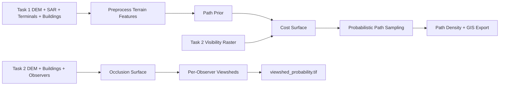

# ARCH

## Primary Architecture
- Language/runtime:
  - Python geospatial pipelines
  - CLI-first
  - file-based artifact exchange between tasks
- Source root: `src/lamp/`

## Module Map
- `src/lamp/core/`
  - shared config loading
  - terrain / IO helpers
  - common models and exceptions
- `src/lamp/tasks/path_tracing/`
  - preprocessing:
    - DEM ingest
    - slope normalization
    - roughness and surface penalty derivation
  - vision:
    - deterministic visible-path prior
    - optional learned prior loading
  - simulation:
    - cost surface construction
    - path sampling
    - calibration
  - gis:
    - raster/vector export
- `src/lamp/tasks/viewsheds/`
  - DEM and observer loading
  - building rasterization
  - occlusion surface construction
  - LOS / viewshed computation
  - GIS export
- `src/lamp/services/`
  - dataset validation
  - raycast benchmark
  - ML diagnostics
  - security audit
- `src/lamp/api/`
  - root operations CLI
- `scripts/`
  - task entry points
  - report / figure utilities

## Data Flow

## Task 1 Cost Model
\[
C = w_s S + w_r R + w_t T + w_p(1-P) + w_v(1-V)
\]

Terms:
- `S`: slope, ROI-normalized to `[0,1]`
- `R`: roughness, ROI-normalized to `[0,1]`
- `T`: surface penalty, ROI-normalized to `[0,1]`
- `P`: path prior probability in `[0,1]`
- `V`: mean visibility probability in `[0,1]`

Invariants:
- weights are finite and renormalized to sum to `1.0`
- nodata or obstacle cells are `inf`
- visibility coupling is optional via `w_v = 0`

## Coupling Contract
- Reference grid: Task 1 DEM grid
- Source raster: Task 2 `viewshed_probability.tif`
- Alignment checks before use:
  - CRS
  - transform
  - width/height
- If mismatch:
  - reproject visibility raster to Task 1 grid
  - bilinear resampling
  - nodata to `NaN`
  - final clip to `[0,1]`

## Entry Points
- Root operations:
  - `python -m lamp.api.cli validate-dataset`
  - `python -m lamp.api.cli benchmark-raycast`
  - `python -m lamp.api.cli ml-diagnostics`
  - `python -m lamp.api.cli security-audit`
- Task execution:
  - `scripts/run_path_tracing.py`
  - `scripts/run_viewsheds.py`

## Stability Boundaries
- Stable:
  - root config schema in `src/lamp/config/pipeline.yaml`
  - task entry points in `scripts/`
  - comparison-mode artifact contract
- Unstable:
  - generated reports under `submission/validation/`
  - legacy submission packaging notes under `submission/docs/`
