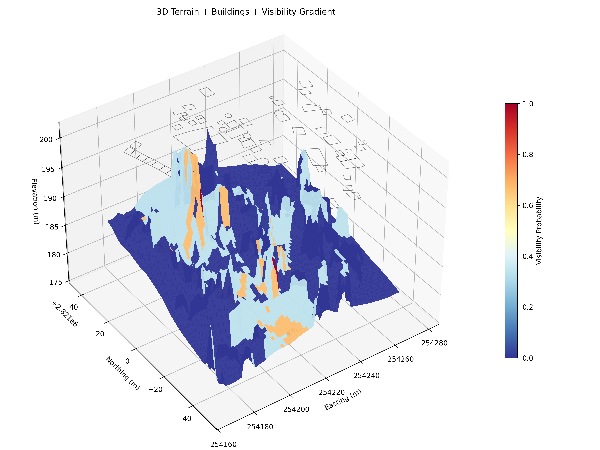
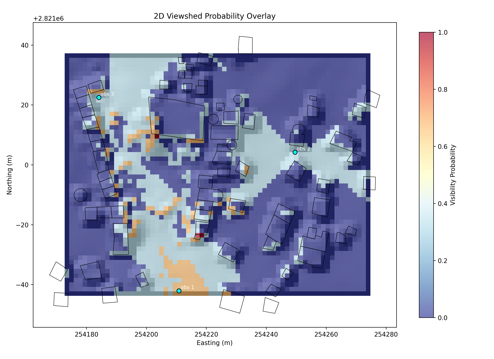

# LAMP: Late Antiquity Modeling Project

[](https://github.com/fallofpheonix/LAMP/actions/workflows/ci.yml)
[](LICENSE)

Deterministic geospatial pipelines for archaeological path tracing, 3D viewshed analysis, and visibility-coupled movement inference.

## Overview

LAMP models movement and visibility in the El Bagawat necropolis using two explicit task surfaces:

- Task 1: probabilistic path tracing over slope, roughness, surface penalty, path priors, and optional visibility coupling
- Task 2: 2D and voxel-3D viewshed generation over terrain and building geometry

The coupling contract is raster-based: Task 2 produces `viewshed_probability.tif`, and Task 1 can consume that aligned raster as an additional movement-cost term.

## Repository Layout

```text
.
├── assets/           Curated figures used in the README
├── data/             Shipped sample GIS inputs for Task 1 and Task 2
├── docs/research/    Research and proposal material kept for project context
├── scripts/          Compatibility wrappers and research utilities
├── src/lamp/         Package source
│   ├── api/          Unified CLI entry points
│   ├── core/         Shared config, IO, terrain, and exception utilities
│   ├── services/     Validation, diagnostics, benchmark, and audit services
│   └── tasks/        Task 1 and Task 2 implementations
└── tests/            Unit and integration tests
```

### Task 2 native dependencies (GDAL)

Task 2 (Viewsheds) requires **GDAL/OGR** system libraries.

- **Ubuntu/Debian**: `sudo apt-get install gdal-bin libgdal-dev`
- **macOS (Homebrew)**: `brew install gdal`
- **Windows**: Use OSGeo4W or the [Conda](https://anaconda.org/conda-forge/gdal) environment.

After installing the system library, install the Python bindings if they were not picked up:

```bash
python -m pip install "gdal==$(gdal-config --version)"
```

Alternatively, use the provided `Dockerfile` which includes a complete GDAL-ready environment.

## Quick Start

Run the canonical path-tracing pipeline on the sample dataset:

```bash
# Task 1: Path tracing (Deterministic fallback)
lamp path-tracing --max-pairs 1 --samples 8

# Task 2: 2.5D Viewshed (Requires GDAL)
lamp viewsheds-2d
```

## CLI

The `lamp` package CLI is the primary entry point:

```bash
# Core Simulation
lamp path-tracing      # Task 1: Probabilistic path tracing
lamp viewsheds-2d      # Task 2: 2.5D deterministic viewshed
lamp viewsheds-3d      # Task 2: 3D voxel viewshed + volume

# Services & Validation
lamp validate-dataset  # Preflight check for Task 1/2 inputs
lamp ml-diagnostics    # Evaluation for learned path priors
lamp security-audit    # Static environment security check
lamp benchmark-raycast # Performance profiling for Task 2 kernels
```

Notes:

- **Missing learned priors**: Task 1 defaults to a deterministic prior with a `RuntimeWarning` if the requested learned prior is missing.
- Task 2 defaults to the shipped `data/task2/` dataset layout.
- `lamp ml-diagnostics` requires explicit training and evaluation path labels because those labels are not shipped in this repository.

The legacy script entry points remain available as wrappers:

```bash
python scripts/run_path_tracing.py
python scripts/run_viewsheds.py
python scripts/run_viewsheds_3d.py
```

## Data

Shipped datasets live under:

- `data/task1/` for path-tracing inputs
- `data/task2/` for viewshed inputs

The repository intentionally does not ship all derived labels and trained artifacts. Commands that require those artifacts accept them explicitly as arguments.

## Testing

Run the test suite from the repository root:

```bash
python -m pytest -q
```

## Research Context

Research and proposal material is preserved under `docs/research/` to document project intent, evaluation framing, and coupling rationale without mixing it into the runtime package surface.

## Visualizations




