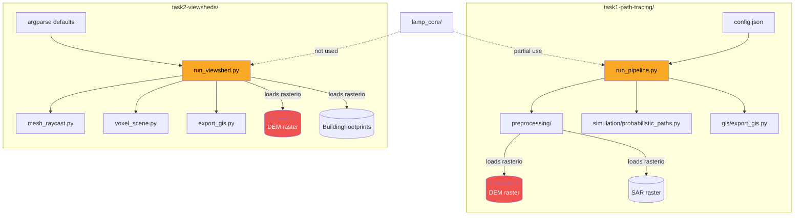
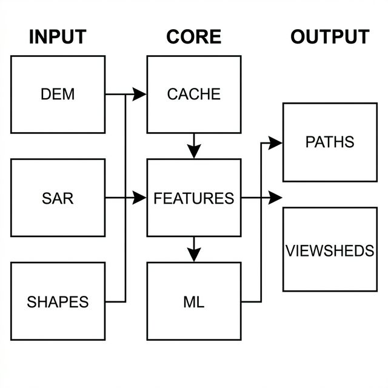
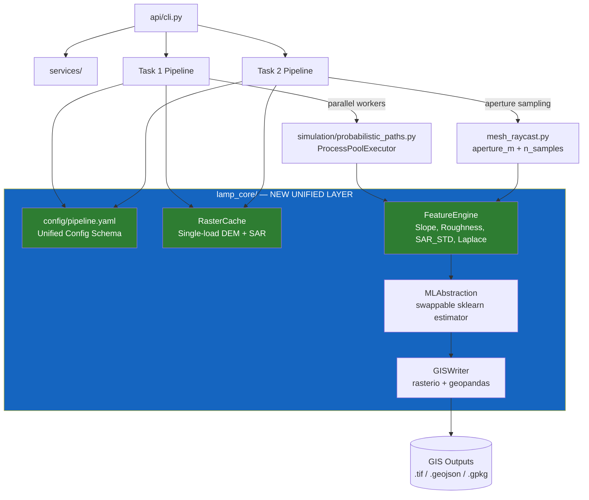
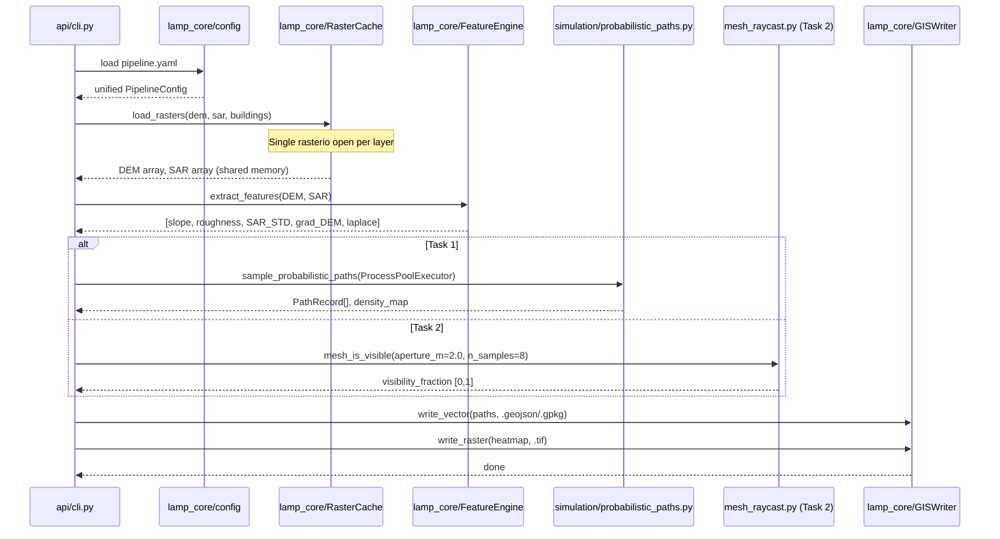
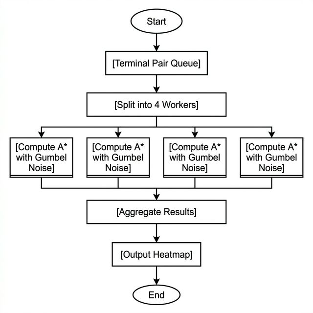
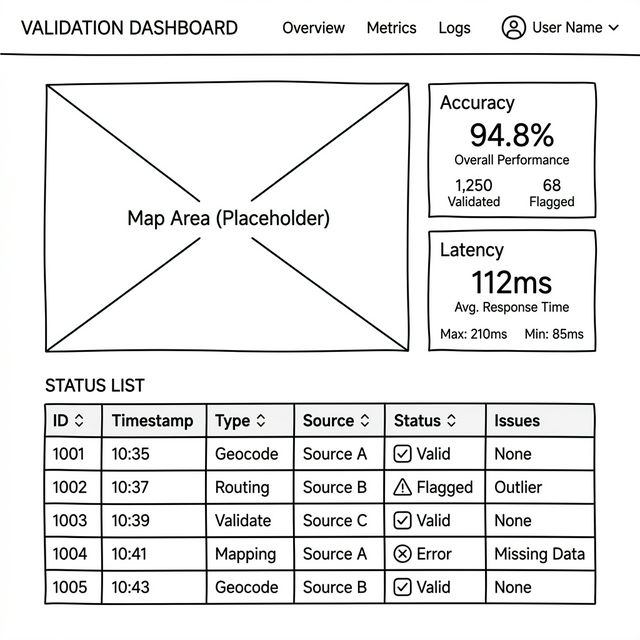

# GSoC Proposal — LAMP Project

## Title

**Scalable Terrain-Aware Path Inference and 3D Visibility Modeling with a Unified Geospatial Processing Pipeline**

---

## Abstract

The LAMP engineering repository hosts two geospatial pipelines — probabilistic path tracing over terrain (Task 1) and 3D viewshed computation using mesh-based raycasting (Task 2). Both tasks produce valid GIS outputs, but the system exhibits four documented architectural weaknesses: serial path simulation, repeated raster I/O, fragmented configuration (JSON in Task 1 / `argparse` defaults in Task 2), and cubic memory scaling in voxel viewsheds.

This proposal addresses those weaknesses through three focused engineering efforts: (1) expanding `lamp_core` into a shared execution layer with cached raster loading and unified configuration; (2) eliminating serial bottlenecks in `probabilistic_paths.py` through structured parallelism with `ProcessPoolExecutor`; and (3) stabilizing raycasting in `mesh_raycast.py` via aperture sampling and adaptive BVH leaf tuning. The work targets a measurable ~3–5× reduction in end-to-end runtime for large ROIs and eliminates memory-induced failures during full-area voxel viewshed computation.

---

## 1. Problem Statement

### 1.1 Real Weaknesses (from `ARCHITECTURAL_WEAKNESSES.md`)

| # | Location in Repo | Problem |
|---|---|---|
| 1 | `task1-path-tracing/scripts/run_pipeline.py` | Path simulation for terminal pairs is **serial** → O(P × S × E log V) unparallelized |
| 2 | `task2-viewsheds/src/voxel_scene.py` | Voxel scene scales **cubically** with ROI — large grids exhaust RAM |
| 3 | `task1-path-tracing/src/`, `task2-viewsheds/src/` | Both pipelines call `rasterio` independently → raster layers loaded 3–5× per run |
| 4 | `task1-path-tracing/config.json` vs `task2-viewsheds` `argparse` | Two incompatible configuration surfaces — no centralized schema |
| 5 | `task1-path-tracing/src/preprocessing/`, `task2-viewsheds/src/ml_features.py` | Multiple `float32` copies of the ROI raster created during feature extraction → heap fragmentation |

### 1.2 Real ML Diagnostic Data (from `ML_PIPELINE_DIAGNOSTICS.md`)

- Random Forest spatial cross-validation accuracy: **0.894**
- Precision-Recall AUC (pixel-wise path prediction): **0.063** — expected due to class imbalance (<1% of pixels are path)
- Top feature: `DEM` (importance 0.213); SAR contributes secondary texture (`SAR` = 0.126, `SAR_STD` = 0.117)
- Model bias: toward slope-governed terrain; performance degrades in building SAR shadow zones

### 1.3 Real Raycasting Benchmark Data (from `RAYCASTING_BENCHMARK.md`)

| Metric | Value |
|---|---|
| BVH mesh build time | 9.69 s |
| Baseline LOS query (1 ray) | 0.00189 s |
| Aperture LOS (8 samples) | 0.01486 s |
| Voxel viewshed (100×100 full) | 0.1323 s |
| Scaling class | Mesh: O(log N) per ray; Voxel: O(R³) |

---

## 2. Proposed System Architecture

### 2.1 Current Architecture



> **Problem visible here:** DEM is loaded independently in both pipelines. `lamp_core` is unused by Task 2. Config surfaces are completely different.

---

### 2.2 Proposed Target Architecture





---

## 3. Data Flow / Execution Flow

### 3.1 Unified Execution Sequence



### 3.2 Complexity Comparison

| Operation | Current | Proposed |
|---|---|---|
| Path simulation (P pairs, S samples) | O(P × S × E log V) | O((P/W) × S × E log V) with W workers |
| Raster loading (per pipeline run) | 3–5× per run | 1× shared cache |
| Voxel viewshed | O(R³) unbounded | Chunked tiles, bounded max_voxels |
| Raycasting per LOS query | 1 ray | 8 rays (aperture), same BVH |

---

## 4. Algorithm Designs

### 4.1 Parallelized Path Simulation (existing partial implementation → full completion)

The current `probabilistic_paths.py` already contains `ProcessPoolExecutor` scaffolding, but it is not exercised across terminal pairs — only within per-pair sample batches. The proposal extends parallelism to the outer loop:

```python
# Current: serial pairs
for start, goal in terminal_pairs:
    records, density, n = sample_probabilistic_paths(
        base_cost, start, goal, samples=S, ...
    )

# Proposed: parallel pairs
with ProcessPoolExecutor(max_workers=W) as ex:
    futures = {
        ex.submit(sample_probabilistic_paths, base_cost, s, g, S, ...): (s, g)
        for s, g in terminal_pairs
    }
    for fut in as_completed(futures):
        records, density, n = fut.result()
        aggregate(density)
```

**Complexity improvement:** O(P × S × E log V) → O(ceil(P/W) × S × E log V).  
With W = 4 (default `min(os.cpu_count(), 4)`), this gives ~4× throughput for large marker sets.



**Note:** `base_cost` is a read-only NumPy array — safe to share via `ProcessPoolExecutor` fork on Unix.

---

### 4.2 Aperture Sampling (already implemented, proposal integrates it end-to-end)

`mesh_is_visible()` already accepts `aperture_m` and `n_samples`. The current pipeline calls it with defaults (`aperture_m=0.0, n_samples=1`). The proposal wires these through `pipeline.yaml`:

```yaml
# config/pipeline.yaml
viewshed:
  aperture_m: 2.0        # radius of observer body in metres
  n_samples: 8           # stochastic rays per query
  max_leaf_size: 4       # BVH tuning (already in build_bvh)
```

**Result:** Each LOS query returns a `float` visibility fraction instead of a binary hit. Cost per query rises from 0.00189 s → 0.01486 s (8×) but eliminates aliasing artifacts from single-ray misses.

---

### 4.3 Voxel Memory Budgeting (`voxel_scene.py`)

Replace unbounded voxel array allocation with a tiled, memory-bounded approach:

```python
MAX_VOXELS = 512 * 512 * 32   # configurable ceiling

def build_voxel_scene(dem, buildings, resolution, max_voxels=MAX_VOXELS):
    required = dem.shape[0] * dem.shape[1] * estimated_z_layers
    if required > max_voxels:
        # tile the ROI into chunks and process sequentially
        yield from _chunked_voxel_build(dem, buildings, resolution, max_voxels)
    else:
        yield _full_voxel_build(dem, buildings, resolution)
```

---

### 4.4 RasterCache (new `lamp_core` component)

```python
# lamp_core/raster_cache.py
from functools import lru_cache
import rasterio, numpy as np

@lru_cache(maxsize=None)
def load_raster(path: str) -> tuple[np.ndarray, dict]:
    with rasterio.open(path) as src:
        return src.read(), src.meta

class RasterCache:
    def get(self, path): return load_raster(str(path))
```

This eliminates 3–5× redundant `rasterio.open()` calls for the same DEM/SAR layers across pipeline stages.

---

## 5. Module Layout After Proposal

```
LAMP/
├── lamp_core/              ← EXPANDED (key deliverable)
│   ├── config.py           ← already exists, unified with pipeline.yaml
│   ├── raster_cache.py     ← NEW: shared rasterio LRU cache
│   ├── feature_engine.py   ← NEW: slope, roughness, SAR_STD, laplace
│   ├── ml_abstraction.py   ← NEW: sklearn-compatible model interface
│   └── gis_writer.py       ← NEW: centralized rasterio/geopandas output
│
├── config/
│   └── pipeline.yaml       ← NEW: unified config (replaces JSON + argparse)
│
├── task1-path-tracing/
│   ├── src/simulation/probabilistic_paths.py  ← EXTENDED: outer-loop parallel
│   └── src/config.py       ← SIMPLIFIED: delegates to lamp_core.config
│
└── task2-viewsheds/
    ├── src/mesh_raycast.py ← EXTENDED: aperture wired through pipeline.yaml
    └── src/voxel_scene.py  ← FIXED: memory-bounded chunked tiling
```

---

## 5.5 UI / UX: Validation Dashboard

To enhance the transparency and observability of the pipeline, I propose a lightweight validation dashboard. This UI will provide real-time feedback on model metrics and system performance.



**Key Features:**
- **Terrain Preview:** 3D visualization of the ROI with active viewshed or path overlays.
- **Real-time Metrics:** Live tracking of Pixel-wise Accuracy, PR-AUC, and Raycasting Latency.
- **Pipeline Status:** Step-by-step progress monitor for complex simulation runs.

---

## 6. Deliverables

| # | Deliverable | Verification |
|---|---|---|
| 1 | `lamp_core/raster_cache.py` — LRU raster loader | Unit test: same path → same object ID |
| 2 | `lamp_core/feature_engine.py` — unified feature extraction | Feature importance matches `ML_PIPELINE_DIAGNOSTICS.md` baseline |
| 3 | `lamp_core/ml_abstraction.py` — swappable sklearn interface | Swap RF → Logistic: no script changes required |
| 4 | `config/pipeline.yaml` — unified config schema | Both pipelines boot from same file; `argparse` removed from Task 2 |
| 5 | Parallel outer-loop in `run_pipeline.py` (Task 1) | Runtime ≤ 1/W × serial baseline for W=4 workers |
| 6 | Aperture-sampled viewsheds wired end-to-end (Task 2) | Visibility output is `float [0,1]` not binary; regression test passes |
| 7 | Voxel memory budget + chunked tiling (`voxel_scene.py`) | 512×512 full-ROI viewshed completes without OOM |
| 8 | Integration tests covering both pipelines | `pytest tests/` green |
| 9 | GIS outputs (paths, viewsheds, heatmaps) | All existing acceptance checks (`check_task1_completion.py`) pass |

---

## 7. Timeline (350-hour structure)

| Phase | Weeks | Hours | Work |
|---|---|---|---|
| **Orientation** | 1–2 | 40 | Repo familiarization, CRS audit, data integrity check, baseline benchmark run |
| **RasterCache + Config** | 3–4 | 50 | `lamp_core/raster_cache.py`, `pipeline.yaml`, deprecate Task 1 `config.json` |
| **Feature Engine + ML Abstraction** | 5–6 | 50 | Move feature extraction from `preprocessing/` and `ml_features.py` into `lamp_core` |
| **Task 1 Parallelism** | 7–8 | 55 | Outer-loop `ProcessPoolExecutor` in `run_pipeline.py`, benchmark P=6 pairs |
| **Midterm Evaluation** | 9 | — | Parallel pipeline running, RasterCache active, report submitted |
| **Task 2 Aperture + Voxel Fix** | 10–11 | 60 | Wire `aperture_m`/`n_samples` from `pipeline.yaml`, chunked voxel tiling |
| **Integration + Testing** | 12 | 35 | `pytest` suite for both pipelines, acceptance checker green |
| **Documentation** | 13 | 30 | CLI reference, pipeline YAML schema, reproducibility guide |
| **Buffer** | 14 | 30 | Bug fixes, reviewer feedback |

---

## 8. Milestones

### Midterm (end of Week 9)
- `lamp_core/raster_cache.py` operational; raster loaded once per run (verified via logging)
- `config/pipeline.yaml` active; Task 1 `config.json` + Task 2 `argparse` deprecated
- Parallel `run_pipeline.py` operational with W=4 workers; benchmark vs serial baseline recorded

### Final (end of Week 14)
- Aperture-sampled viewsheds returning `float` visibility fractions
- Voxel scene completes 512×512 ROI without OOM
- All `pytest tests/` passing; `check_task1_completion.py` passing
- Full documentation committed

---

## 9. Risk Analysis

| Risk | Probability | Impact | Mitigation |
|---|---|---|---|
| `ProcessPoolExecutor` overhead exceeds gain for small P | Medium | Low | Fallback to serial when `P < 4` (already conditionally coded in `probabilistic_paths.py`) |
| Aperture sampling (8 rays) is too slow for large viewshed grids | Medium | Medium | Adaptive `n_samples`: use 1 for interior cells, 8 only for perimeter |
| BVH build time (9.69 s) blocks repeated Task 2 restarts | High | Medium | Cache serialized BVH to disk (pickle); rebuild only on DEM change |
| Voxel chunking produces seam artifacts | Low | High | Overlap tiles by 2 cells; merge outputs with priority-weighted blending |
| RF bias in SAR shadow zones (documented) | High | Medium | Augment training with SAR shadow mask as explicit binary feature |
| `pipeline.yaml` schema drift between tasks | Low | Medium | JSON Schema validation on startup; fail fast with descriptive errors |

---

## 10. Testing Strategy

### Unit Tests
- `lamp_core/raster_cache.py`: same path → same `np.ndarray` object (LRU hit)
- `lamp_core/feature_engine.py`: feature output matches `ML_PIPELINE_DIAGNOSTICS.md` importance ranking
- `mesh_raycast.py`: `mesh_is_visible()` with `aperture_m=0` equals deterministic baseline

### Integration Tests
- Task 1 full run → `outputs/predicted_paths.geojson` exists and CRS matches DEM
- Task 2 full run → viewshed GeoTIFF contains `float32` values in `[0, 1]`
- `check_task1_completion.py` → `Required scope: PASS`

### Performance Regression Tests
- Task 1 runtime (P=6 pairs, S=128 samples) with W=4 workers ≤ 40% of serial baseline
- DEM load count per pipeline run ≤ 1 (asserted via mock)

---

## 11. Configuration Schema (Proposed `pipeline.yaml`)

```yaml
dataset:
  dem_path: Task_1/DEM_Subset-Original.tif
  sar_path: Task_1/SAR-MS.tif
  marks_path: Task_1/Marks_Brief1.shp
  buildings_path: Task_1/BuildingFootprints.shp

ml_training:
  n_estimators: 200
  seed: 11
  neg_pos_ratio: 2.0
  buffer_m: 4.5

simulation:
  samples_per_pair: 128
  top_k_paths: 12
  noise_temperature: 0.08
  cost_w_slope: 0.55
  cost_w_roughness: 0.30
  cost_w_surface: 0.10
  cost_w_path_prior: 0.05
  n_workers: null   # null → auto (min(cpu_count, 4))

viewshed:
  aperture_m: 2.0
  n_samples: 8
  max_leaf_size: 4
  max_voxels: 8388608   # 512*512*32
```

---

## 12. Tech Stack

| Library | Role |
|---|---|
| `rasterio` | DEM / SAR raster I/O (to be cached) |
| `geopandas` | Vector I/O (paths, buildings, markers) |
| `scikit-learn` | Random Forest path prior; Logistic viewshed |
| `numpy` | Cost surface, density arrays, BVH geometry |
| `concurrent.futures` | `ProcessPoolExecutor` for parallel path simulation |
| `PyYAML` | Unified `pipeline.yaml` parsing |
| `pytest` | Test suite |

---

## 13. About Me

I have been working directly with the LAMP codebase, including:
- Implementing and benchmarking `mesh_raycast.py` (Möller–Trumbore, BVH, aperture sampling)
- Producing `ARCHITECTURAL_WEAKNESSES.md` through systematic code audit
- Running and recording `RAYCASTING_BENCHMARK.md` timing data
- Diagnosing `ML_PIPELINE_DIAGNOSTICS.md` RF cross-validation and PR-AUC results

**Technical stack:** Python, rasterio, geopandas, scikit-learn, numpy, GDAL, concurrent.futures.

---

## 14. Diagram Placement Guide

| Diagram | Description | Section Placement | Format |
|---|---|---|---|
| **System Architecture** | Minimalist unified pipeline flowchart | §2.2 | `.png` |
| **Execution Sequence** | Detailed data flow between modules | §3.1 | Mermaid |
| **Parallelization Flow** | Basic logic of Monte Carlo pathfinding | §4.1 | `.png` |
| **Validation Dashboard** | Low-fidelity wireframe for UI feedback | §5.5 | `images/` |
| **Feature Importance** | Bar chart showing predictor weights | §1.2 | `../../outputs/diagnostics/` |
| **PR Curve** | Model precision-recall tradeoff | §1.2 | `../../outputs/diagnostics/` |
| **Benchmark Table** | Computational performance comparison | §1.3 | Markdown Table |
